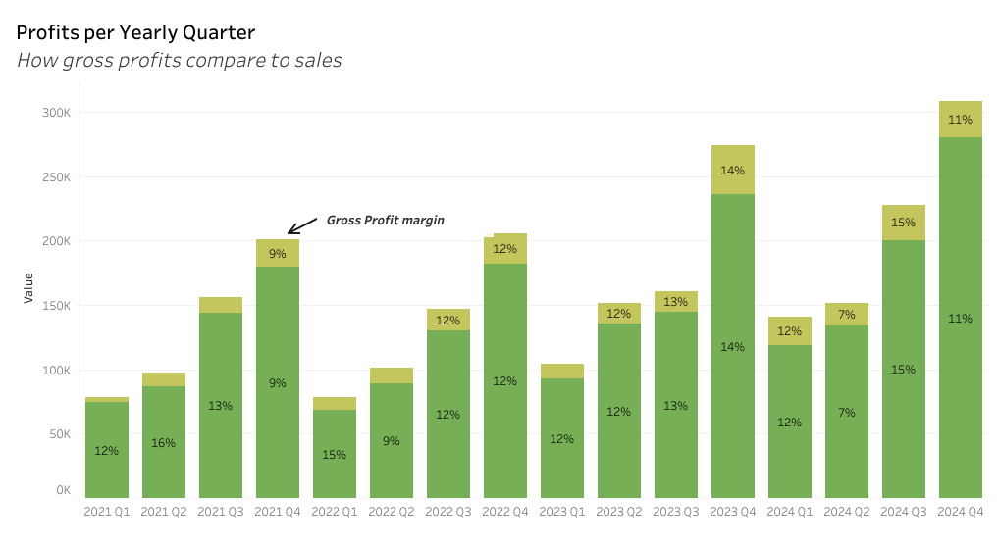
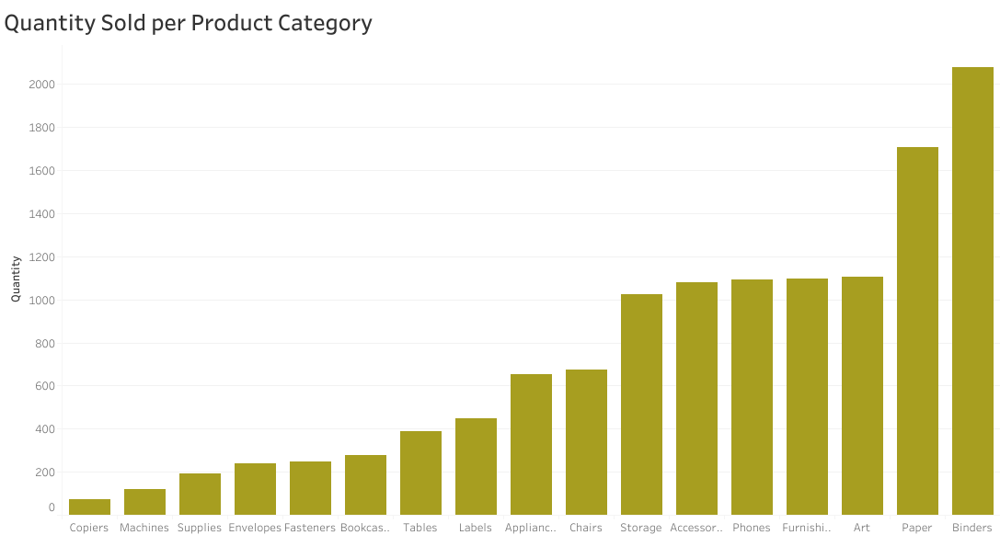

# FurniHub Data Analysis Report

## Background and Overview  

Furnihub is a retail business specializing in furniture, technology, and stationery, with a substantial dataset collected over the past four years. The company aims to leverage this data to optimize its profit margins. The goal of this analysis is to uncover insights into pricing strategies, cost of goods, and customer preferences, with the aim of driving greater profitability. Key performance indicators (KPIs) such as sales growth, profit margin, and discount effectiveness will be integral in guiding the analysis and providing actionable recommendations to achieve these objectives. 

## Data Description and Methodology 

Data was collected from kaggle. It is a synthetic dataset that reflects real world store data. Data Cleaning and preprocessing was done in Python. Excel and Tableau were used for data visualization.

## Executive Summary 

In 2024, the company achieved a **20.6% revenue growth**, increasing from $608,473.83 in the previous year to $733,947.02. However, the gross profit margin remains significantly low at far below the **global average of 50%**. To enhance profitability, a strategic review of pricing and discount structures is essential. This report examines the key factors contributing to the low profit margin and presents actionable strategies for improvement. 

## Sales Performance and Profitability Analysis  

Sales have experienced a **20.6% year-over-year increase** in 2024, indicating strong revenue growth.  

However, **gross profit remains low**, suggesting inefficiencies in cost management or pricing strategies.  

Certain products—**Tables, Machines, Supplies, and Bookcases**—are being sold at a loss, negatively impacting overall profitability.  

A key factor contributing to this issue is the **low sales volume** of these products, meaning they do not generate enough revenue to cover associated costs.  

## Price Markup 

Another key factor contributing to product profit loss is low price markups on the least profitable products. These products—Tables, Machines, Supplies, and Bookcases—have narrow profit margins, meaning their selling prices are not sufficiently above cost to generate a healthy profit. 

Additionally, low markup strategies may be failing to drive higher sales volume, resulting in products that remain unprofitable despite being sold. This suggests a need for pricing optimization to better align costs with revenue generation. 

## Discount Effectiveness  

The business is not effectively utilizing discounts to drive profitability. Key issues include:  

- **Profit loss beyond 25% discounts** – Discounts exceeding this threshold reduce profit margins without significantly increasing sales.  

- **Discounting low-sales products** – The business is primarily discounting **Tables, Machines, Supplies, and Bookcases**, which already have low demand. Discounts are not boosting sales volume enough to offset the losses.  

- **Potential devaluation of products** – Frequent discounts may lead customers to expect lower prices, making it harder to sell products at full price.  

- **Negative impact on long-term profitability** – Excessive discounting can weaken brand perception and reduce overall revenue sustainability.  

## Recommendations  

### Improve Product Profitability  
- Reevaluate pricing strategies for low-profit products (**Tables, Machines, Supplies, Bookcases**).  
- Increase sales volume for these products through **bundling** or **targeted marketing**.  
- Reduce costs by **negotiating supplier prices** or **optimizing inventory management**.  

### Optimize Price Markups  
- Adjust markups to **ensure profitability while remaining competitive**.  
- Analyze **competitor pricing** and **market demand** to refine pricing strategies.  
- Implement **dynamic pricing** to maximize revenue based on demand fluctuations.  

### Refine Discount Strategies  
- **Limit excessive discounts (above 25%)** to prevent profit erosion.  
- Avoid discounting low-sales products unless paired with **effective promotional tactics**.  
- Use **targeted discounts** for high-demand products or loyal customers instead of blanket markdowns.  
- Experiment with alternative incentives like **cashback, loyalty rewards, or time-limited promotions**.  

### Leverage Machine Learning for Profit Optimization  
- Utilize the **ML model** developed to predict profit, helping identify which products are most likely to generate revenue.  
- Use model insights to adjust **pricing, discounts, and marketing strategies** based on predicted profitability.  
- Improve **demand forecasting** by incorporating the model into sales and inventory planning.  
- Continuously **refine the model** with updated data to enhance accuracy and decision-making.  

## Conclusions 

The analysis highlights key factors affecting profitability, including low sales volume, inadequate price markups, and ineffective discount strategies. While sales have increased by 20.6% in 2024, profit margins remain low due to unsustainable discounting and underperforming products. 

By implementing optimized pricing, strategic discounting, and data-driven decision-making, the business can improve profitability while maintaining competitive sales growth. Additionally, integrating the machine learning model to predict profit will enhance decision-making by providing insights into pricing, product performance, and demand forecasting. 
